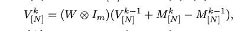

exclude alpha for gt_nsgdm, gaussian noise
10
5
1
0.5
0.1
less than 0.005

just compare 0.01 and 0.05
best: alpha 0.01, beta 0.8

# 1
$$

$$

There are three ways to understand matrix production $C=A*B$
one is to focus on each entry of C, $C_{i,j}=A_{i,1}*B_{1,j}+A_{i,2}*B_{2,j}+...$
The second way is to focus on each row of C, $C_{i,:}=A_i*B$
The third way is to focus on each column of C, $C_{:,j}=A*B_{:,j}$

To understand the above formula with kronecker product, if we focus on every entry of the result, it would be very hard to understand, because there are too many etries. The best way is to focus on every matrix (view matrices like $W_{11}I$ and $V_1$ as entries) of the result:
$$
W \otimes I=\begin{pmatrix}W_{11}I & W_{12}I & ..\\
W_{21}I & W_{22}I & ..\\
\end{pmatrix}
$$
$$
W \otimes I * V_{[N]}=\begin{pmatrix}
W_{11}I*V_1+W_{12}I*V_2+.. \\ W_{21}I*V_1+W_{22}I*V_2+.. \\
\end{pmatrix}
$$
